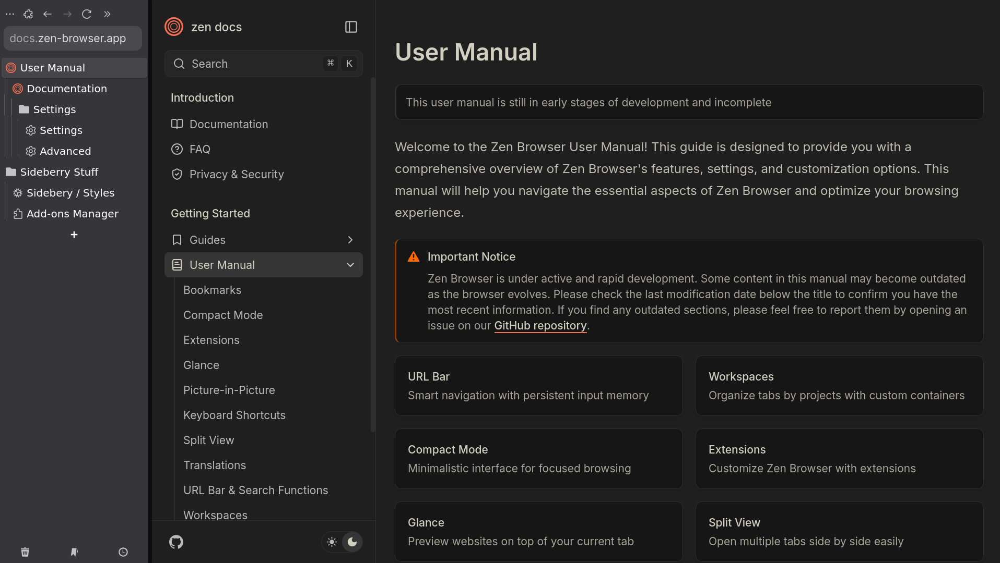

# ⚙️ Configuration Guide

This guide explains how to configure **Zen** with custom styles and Sidebery integration.

---

## 1. Add `userChrome.css` to your Zen profile

1. Open Zen and navigate to `about:config` in the URL bar.

   * Set:

     ```
     toolkit.legacyUserProfileCustomizations.stylesheets = true
     ```

2. Open `about:profiles` in the URL bar.

   * Find your **Root Directory** → click **Open Folder**.
   * ⚠️ Note: the **Flatpak directory** is different.

3. Inside that profile folder:

   * Create a folder named `chrome`.
   * Place your `userChrome.css` file inside.

---

## 2. Add custom CSS to Sidebery

1. Open **Sidebery Settings**.
2. Scroll down and open the **Styles Editor** tab.
3. Copy & paste your CSS into the code editor on the right.

---

## 3. Set Zen’s Look and Feel

* In Zen, go to **Look and Feel**.
* Select **Single Toolbar**.

---

## 4. Adjust `about:config` settings

Open `about:config` and set the following preferences:

```ini
theme.sidebery.hide-zen-tabbar      = true
zen.tabs.vertical.right-side        = false
zen.theme.content-element-separation = 0
zen.view.compact-should-enable-at-startup = false
zen.view.compact-hide-toolbar       = true
zen.urlbar.behavior                 = normal
```

---

✅ You’re done! Restart Zen to apply all changes.

---


